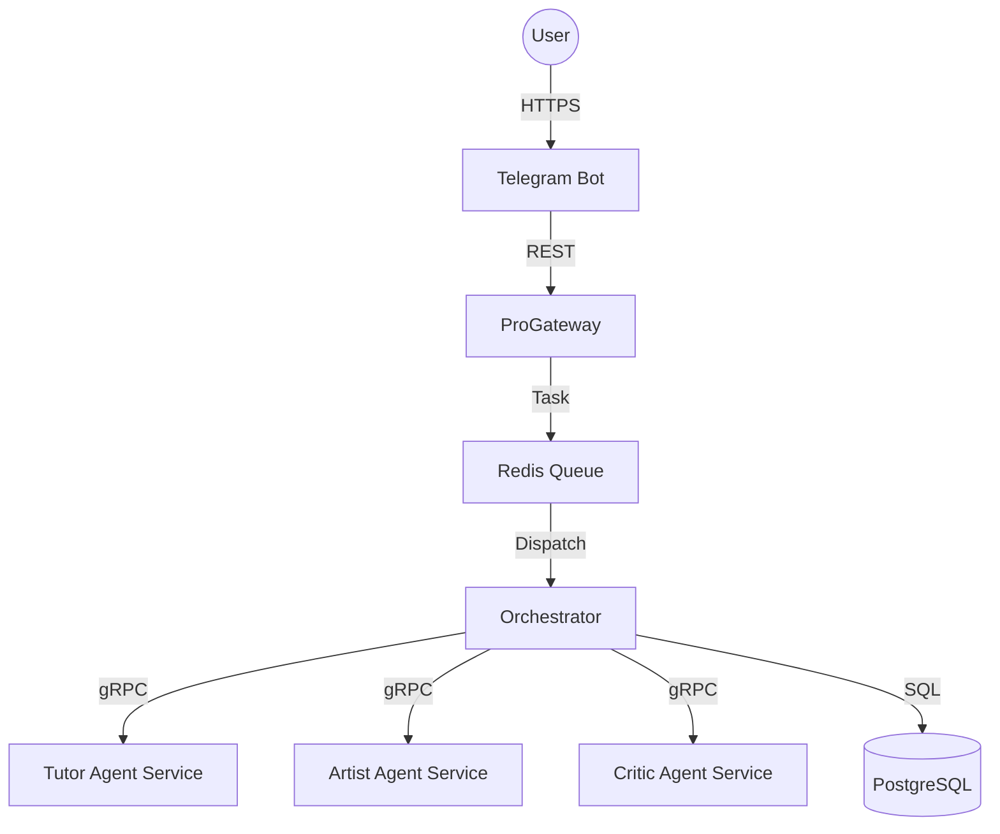

# Artfish Studio Pro: 高度可扩展多智能体系统架构规范

## 1. 系统架构概述 (System Overview)

Artfish Studio Pro 采用 **分布式 Agent 微服务架构**，通过中央编排网关实现多智能体协同、辩论与创作。

### 核心组件
- **ProGateway (API 网关)**: 实现速率限制、熔断机制与响应缓存。
- **Agent Orchestrator (编排引擎)**: 负责 Agent 注册、任务分解、并行调度与交叉验证。
- **Persona Engine (个性化引擎)**: 基于用户历史行为数据，动态调整 Agent 的性格、语调与评价维度。
- **Distributed Queue (分布式队列)**: 基于 Redis 的任务调度系统。

## 2. 交互模式 (Interaction Patterns)

### A. 辩论模式 (Debate Mode)
当用户提交具有争议性或深度的艺术话题时，系统启动辩论流：
1. **Pro-Agent** 陈述支持观点。
2. **Con-Agent** 接收前者输出并进行反驳。
3. **Critic-Agent** 总结并给出中立评分。

### B. 链式协同 (Chain Processing)
1. **Tutor** (艺术知识提取) -> **Artist** (创意方案生成) -> **Critic** (质量把关)。

## 3. 技术规范 (Technical Specification)

### 通信协议
- **gRPC**: Agent 节点间的高性能二进制通信。
- **Protobuf**: 统一的数据交换格式 (参考 `core/agent_service.proto`)。

### 性能指标
- **并发处理**: 支持 1000+ 并发用户。
- **延迟**: 系统内部调度延迟 < 100ms，整体 P99 响应 < 500ms (不含 LLM 生成时间)。

## 4. 部署架构 (Deployment)

## 6. 个性化引擎与用户画像 (Persona & User Profiling)

### 用户画像构建方案
系统通过 `PersonaEngine` 实时分析用户的历史交互数据（存储在 `AgentExecution` 与 `ActionTrace` 中）：
- **互动偏好**: 统计用户偏好的 Agent 角色。
- **情感倾向**: 提取用户消息中的关键词（如“美”、“丑”、“深刻”）。
- **参与度**: 根据会话长度与频率动态调整 Agent 的性格倾向。

### 模型微调建议 (Training/Fine-tuning)
虽然系统目前基于 LLM Prompt Engineering 实现个性化，但对于超大规模应用，建议采用以下微调方案：
1. **数据收集**: 导出 `interaction_history` 作为训练集。
2. **格式化**: 转换为 `{"prompt": "...", "completion": "..."}` 格式。
3. **微调**: 使用 OpenAI Fine-tuning API 或 LoRA 技术在 Llama/Mistral 模型上进行微调，以固化特定的艺术点评风格。
